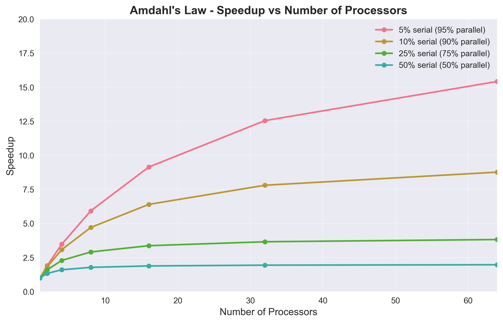
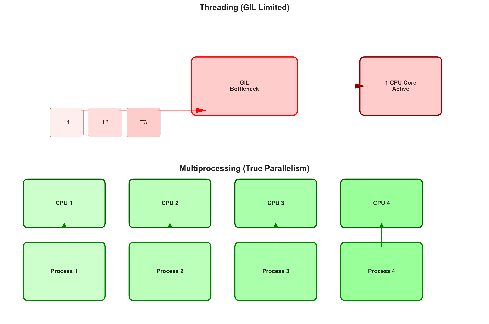
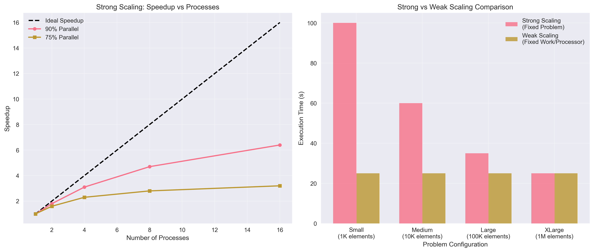
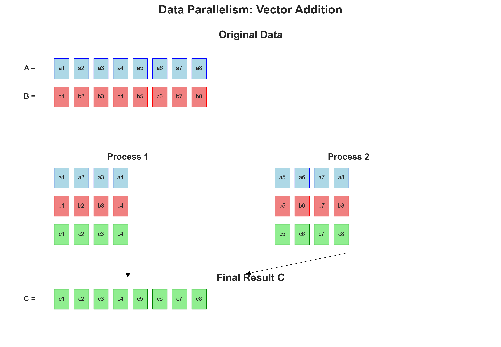
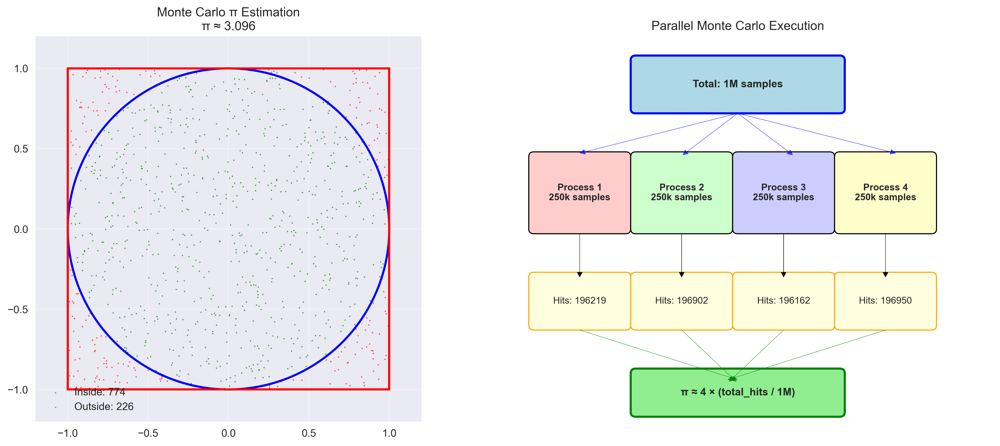

# 🧩 Aula 1 – Pensando em Paralelismo e Performance (CPU)

**Computação de Alto Desempenho em Python para Engenharia Civil**

---

## 📋 Agenda da Aula

1. **Motivação:** Por que HPC em Engenharia Civil?
2. **Conceitos Fundamentais** de Paralelismo
3. **Python e o GIL** - Limitações e Soluções
4. **Multiprocessing** em Python
5. **Métricas de Performance**
6. **Aplicações Práticas** - Demonstrações
7. **Exercícios e Discussão**

---

## 🎯 Por que Engenheiros Civis precisam de HPC?

### Problemas Computacionalmente Intensivos

- **🏗️ Análise Estrutural (FEM)**
  - Matrizes de rigidez enormes (milhões de DOF)
  - Análise dinâmica e não-linear
  - Otimização de design

- **🌊 Mecânica dos Fluidos (CFD)**
  - Simulação de vento em edifícios
  - Análise de barragens e vertedouros
  - Transporte de sedimentos

- **🔥 Transferência de Calor**
  - Análise térmica de estruturas
  - Comportamento ao fogo
  - Conforto térmico

- **📊 Análise Probabilística**
  - Monte Carlo para confiabilidade
  - Análise de risco sísmico
  - Variabilidade de materiais

---

## 📈 O Crescimento dos Problemas

### Lei de Moore vs. Realidade Atual

```
Década de 1990: Frequência da CPU dobrava a cada 2 anos
Hoje: Frequências estagnadas (~3-4 GHz)
Solução: MAIS NÚCLEOS!
```

### Escalabilidade dos Problemas

| Resolução da Malha | Elementos | Tempo Serial | Memória |
|-------------------|-----------|--------------|---------|
| Grosseira         | 10³       | segundos     | MB      |
| Média             | 10⁶       | minutos      | GB      |
| Fina              | 10⁹       | dias/semanas | TB      |

**💡 Questão:** *O que acontece se eu dobrar a resolução da minha malha?*

---

## 🔄 Conceitos Fundamentais de Paralelismo

### Computação Serial vs Paralela

#### Serial (Tradicional)
```
Tarefa A → Tarefa B → Tarefa C → Tarefa D
         (tempo total = t_A + t_B + t_C + t_D)
```

#### Paralela (Objetivo)
```
Núcleo 1: Tarefa A
Núcleo 2: Tarefa B  ← Executando simultaneamente
Núcleo 3: Tarefa C
Núcleo 4: Tarefa D
         (tempo total ≈ max(t_A, t_B, t_C, t_D))
```

### Lei de Amdahl

**Fórmula:** `Speedup = 1 / (S + (1-S)/P)`

Onde:
- **S** = fração serial do código (não paralelizável)
- **P** = número de processadores
- **1-S** = fração paralelizável

**Implicação:** Mesmo com infinitos processadores, speedup ≤ 1/S



---

## 🐍 Python e o Global Interpreter Lock (GIL)

### O Problema do GIL

```python
# ❌ Threading em Python - NÃO funciona para CPU intensivo
import threading

def trabalho_pesado():
    for i in range(10**7):
        i * i * i  # Operação CPU intensiva

# Mesmo com threads, apenas 1 thread executa de cada vez!
```

### Por que o GIL existe?

1. **Simplifica** o desenvolvimento do interpretador Python
2. **Protege** estruturas internas de condições de corrida
3. **Facilita** integração com bibliotecas C
4. **Evita** problemas de sincronização complexos

### Soluções para Contornar o GIL

| Abordagem | Quando Usar | Limitações |
|-----------|-------------|------------|
| **Threading** | I/O intensivo | Não para CPU |
| **Multiprocessing** | CPU intensivo | Overhead de comunicação |
| **NumPy/SciPy** | Operações vetorizadas | GIL liberado automaticamente |
| **Numba/Cython** | Loops pesados | Compilação necessária |



---

## ⚙️ Multiprocessing em Python

### Conceitos Chave

#### Processo vs Thread
- **Processo:** Espaço de memória separado, overhead maior
- **Thread:** Compartilha memória, menor overhead, limitado pelo GIL

#### Tipos de Paralelismo
1. **Task Parallelism:** Tarefas diferentes em paralelo
2. **Data Parallelism:** Mesma operação em dados diferentes

### Ferramentas Principais

```python
import multiprocessing as mp
from concurrent.futures import ProcessPoolExecutor

# Método 1: Pool de processos
with mp.Pool(processes=4) as pool:
    resultados = pool.map(funcao, dados)

# Método 2: ProcessPoolExecutor (mais moderno)
with ProcessPoolExecutor(max_workers=4) as executor:
    futures = [executor.submit(funcao, dado) for dado in dados]
    resultados = [future.result() for future in futures]
```

---

## 📊 Métricas de Performance

### Speedup
```
Speedup = Tempo_Serial / Tempo_Paralelo
```

- **Speedup = P** (ideal, onde P = número de processos)
- **Speedup < P** (real, devido a overhead)

### Eficiência
```
Eficiência = Speedup / P
```

- **100%** = paralelização perfeita
- **< 100%** = há overhead e gargalos

### Strong vs Weak Scaling

#### Strong Scaling
- Problema **fixo**, varia número de processadores
- Objetivo: reduzir tempo total
- Limitado pela Lei de Amdahl

#### Weak Scaling
- Trabalho **por processador** fixo
- Objetivo: resolver problemas maiores
- Pode manter eficiência constante



---

## 🔢 Exemplo 1: Soma de Vetores

### Teoria: Data Parallelism

```
Vetor A = [a₁, a₂, a₃, a₄, a₅, a₆, a₇, a₈]
Vetor B = [b₁, b₂, b₃, b₄, b₅, b₆, b₇, b₈]

Serial: A + B elemento por elemento

Paralelo (2 processos):
Processo 1: [a₁+b₁, a₂+b₂, a₃+b₃, a₄+b₄]
Processo 2: [a₅+b₅, a₆+b₆, a₇+b₇, a₈+b₈]
```



### Aplicação em Engenharia
- Soma de forças nodais em FEM
- Operações vetoriais em análise estrutural
- Processamento de dados de sensores

**→ Demonstração no Notebook**

---

## 🎲 Exemplo 2: Monte Carlo para π

### Teoria: Métodos Probabilísticos

```
π ≈ 4 × (pontos_dentro_círculo / total_pontos)

Círculo: x² + y² ≤ 1
Quadrado: -1 ≤ x,y ≤ 1
```



### Paralelização
- Cada processo gera amostras independentes
- Sem dependências entre processos
- "Embarrassingly parallel"

### Aplicação em Engenharia
- **Análise de confiabilidade** estrutural
- **Simulação de carregamentos** aleatórios  
- **Análise de incertezas** em materiais

**→ Demonstração no Notebook**

---

## 🔢 Exemplo 3: Multiplicação de Matrizes

### Teoria: Álgebra Linear Paralela

```
C = A × B

C[i,j] = Σ(A[i,k] × B[k,j])

Paralelização por linhas:
Processo 1: calcula linhas 1-n/4 de C
Processo 2: calcula linhas n/4+1-n/2 de C
...
```

### Aplicação em Engenharia
- **Sistema Ku = F** (análise estrutural)
- **Autovalores** para análise modal
- **Operações** em grande escala

**→ Demonstração no Notebook**

---

## 🏗️ Exemplo 4: Análise Estrutural Simplificada

### Teoria: Análise de Vigas

Para viga simplesmente apoiada com carga central P:

```
Deflexão máxima: δ = P×L³/(48×E×I)
Momento máximo:   M = P×L/4
Tensão máxima:    σ = M×c/I
```

### Paralelização
- Analisar **múltiplas vigas** simultaneamente
- Cada processo: parâmetros diferentes (P, L, E, I)
- Análise paramétrica eficiente

### Aplicação Prática
- **Dimensionamento** otimizado
- **Análise de sensibilidade**
- **Verificação** de códigos normativos

**→ Demonstração no Notebook**

---

## 💡 Boas Práticas

### ✅ Quando Usar Multiprocessing

1. **CPU intensivo:** Loops pesados, cálculos matemáticos
2. **Dados independentes:** Podem ser processados separadamente
3. **Overhead aceitável:** Tempo de execução > tempo de setup

### ❌ Quando NÃO Usar

1. **I/O intensivo:** Use threading ou async
2. **Pouco trabalho:** Overhead > benefício
3. **Memória limitada:** Cada processo consome RAM

### Otimizações

```python
# ✅ Bom: reutilizar pool
with ProcessPoolExecutor(max_workers=4) as executor:
    for batch in data_batches:
        executor.map(process_batch, batch)

# ❌ Ruim: criar processo para cada tarefa pequena
for item in small_items:
    executor.submit(process_item, item)
```

---

## 🎯 Pontos Principais para Recordar

### Conceitos Teóricos
1. **Lei de Amdahl** limita speedup máximo
2. **GIL** impede paralelismo real com threads
3. **Multiprocessing** contorna GIL com overhead

### Implementação Prática
1. **ProcessPoolExecutor** é mais moderno que Pool
2. **Medição** é essencial: sempre compare performance
3. **Tamanho do problema** determina eficácia

### Aplicações
1. **Data parallelism** funciona bem em engenharia
2. **Monte Carlo** é naturalmente paralelo
3. **Álgebra linear** tem muitas oportunidades

---

## 🚀 Próximos Passos

### Nesta Aula
- Praticar com exemplos do notebook
- Medir speedup e eficiência
- Entender limitações e overhead

### Próxima Aula
- **Ferramentas avançadas:** joblib, numba
- **Scaling studies** detalhados
- **Otimização** de código Python

### Para Casa
- Aplicar multiprocessing em problema próprio
- Experimentar com diferentes números de processos
- Documentar resultados de performance

---

## ❓ Perguntas e Discussão

**Questões para reflexão:**

1. Como identificar gargalos em meu código?
2. Qual o número ideal de processos?
3. Como adaptar algoritmos existentes?
4. Quando vale a pena paralelizar?

**Desafio:** Pense em um problema da sua área de pesquisa que poderia se beneficiar de paralelização!

---

**Vamos para o Notebook! 💻**