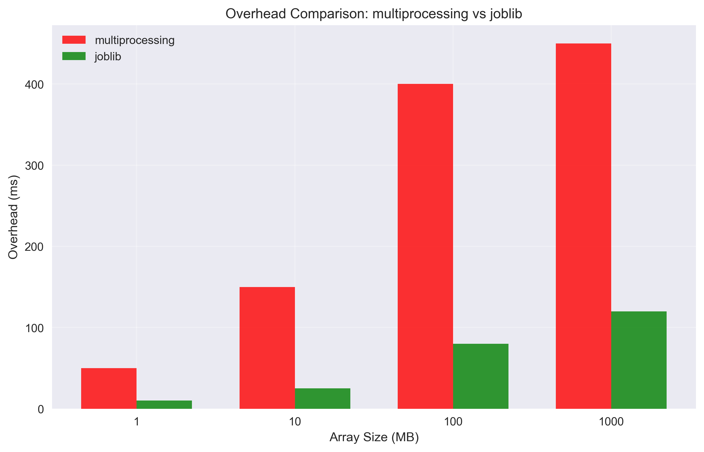
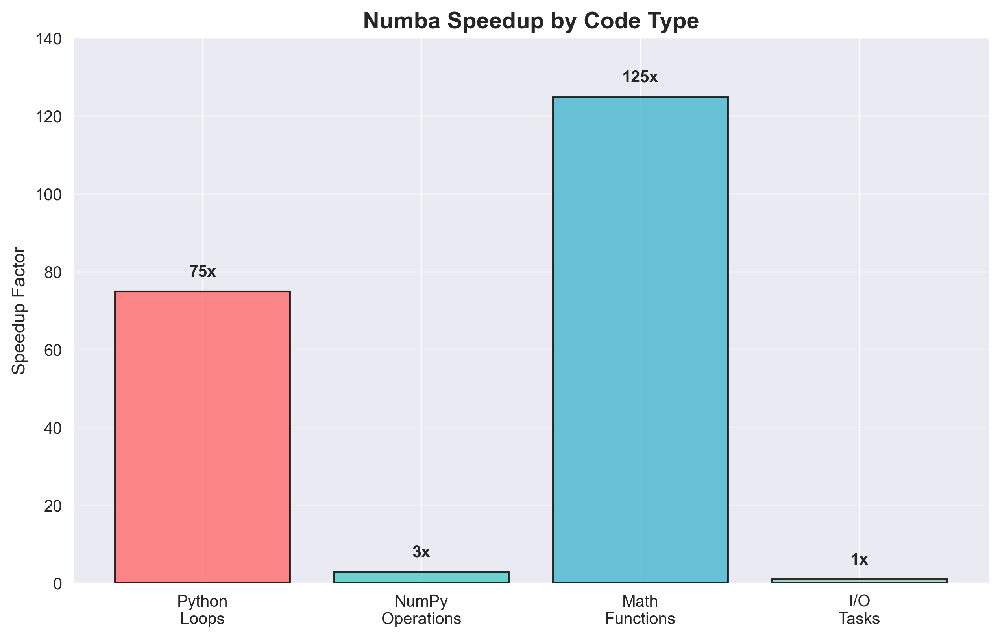
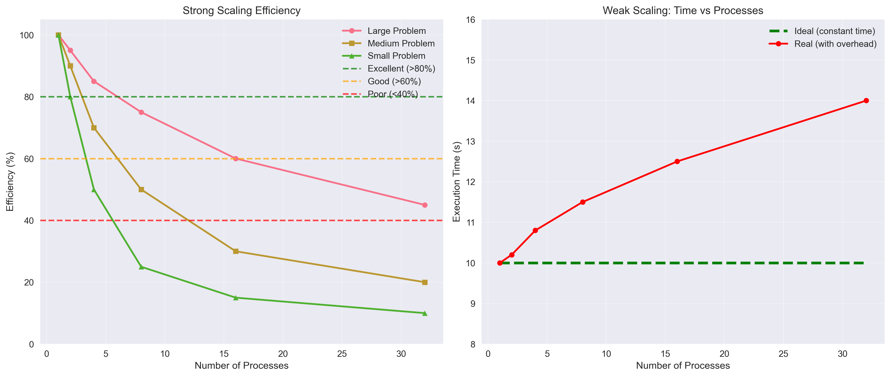
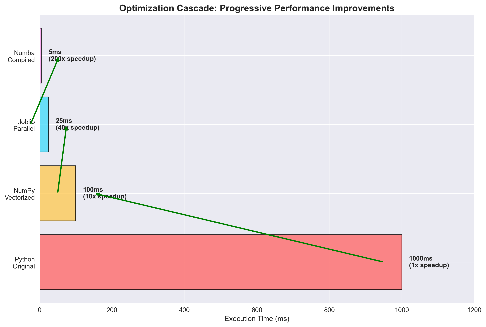

# ⚙️ Aula 2 – Paralelismo Avançado e Escalabilidade

**Computação de Alto Desempenho em Python para Engenharia Civil**

---

## 📋 Agenda da Aula

1. **Revisão** - Conceitos da Aula 1
2. **Medição de Performance** Profissional
3. **concurrent.futures** Avançado
4. **Joblib** - Paralelização Simplificada
5. **Numba** - Compilação JIT
6. **Scaling Studies** - Strong vs Weak
7. **Casos Reais** de Otimização
8. **Boas Práticas** e Pitfalls

---

## 🔄 Revisão: Fundamentos

### O que Aprendemos na Aula 1

#### Conceitos Principais
- **Paralelismo** quebra GIL do Python
- **Multiprocessing** para CPU intensivo  
- **Lei de Amdahl** limita speedup
- **Data parallelism** funciona bem

#### Ferramentas Básicas
```python
from concurrent.futures import ProcessPoolExecutor

with ProcessPoolExecutor(max_workers=4) as executor:
    results = executor.map(function, data)
```

### Limitações Identificadas

1. **Overhead** de criação de processos
2. **Comunicação** entre processos cara
3. **Memória** duplicada por processo
4. **Setup complexo** para casos simples

**→ Como podemos melhorar?**

---

## 📊 Medição de Performance Profissional

### Além do `time.time()`

#### Timing Preciso
```python
import timeit

# Para funções rápidas
tempo = timeit.timeit(funcao, number=1000)

# Com setup personalizado
tempo = timeit.timeit(
    'funcao(dados)', 
    setup='from modulo import funcao, dados',
    number=100
)
```

#### Profiling Detalhado
```python
import cProfile
import pstats

pr = cProfile.Profile()
pr.enable()
# ... código a analisar ...
pr.disable()

stats = pstats.Stats(pr)
stats.sort_stats('cumulative').print_stats(10)
```

### Métricas Importantes

| Métrica | Fórmula | Interpretação |
|---------|---------|---------------|
| **Speedup** | T_serial / T_parallel | Aceleração obtida |
| **Eficiência** | Speedup / P | Utilização dos recursos |
| **Overhead** | T_parallel × P - T_serial | Tempo perdido |
| **Scaling** | f(P) | Como performa vs recursos |

---

## 🔧 concurrent.futures Avançado

### Além do `map()`

#### submit() e as_completed()
```python
from concurrent.futures import ProcessPoolExecutor, as_completed

futures = []
with ProcessPoolExecutor() as executor:
    for data in datasets:
        future = executor.submit(process_data, data)
        futures.append(future)
    
    for future in as_completed(futures):
        result = future.result()
        # Processa resultado conforme fica pronto
```

#### Vantagens
- **Controle fino** sobre execução
- **Resultados incrementais** 
- **Error handling** individual
- **Progress tracking** possível

### Padrões Avançados

#### Map com Argumentos Múltiplos
```python
# Dados de entrada
materials = ['steel', 'concrete', 'wood']
loads = [1000, 2000, 3000]  # kN
factors = [1.5, 1.4, 1.2]

# Análise paralela
with ProcessPoolExecutor() as executor:
    results = executor.map(analyze_structure, materials, loads, factors)
```

#### Timeout e Error Handling
```python
from concurrent.futures import TimeoutError

try:
    result = future.result(timeout=30)  # 30 segundos máximo
except TimeoutError:
    print("Análise demorou muito!")
except Exception as e:
    print(f"Erro na análise: {e}")
```

---

## 🛠️ Joblib - Paralelização Simplificada

### Por que Joblib?

- **Sintaxe simples** como list comprehension
- **Otimizado** para NumPy arrays
- **Menos overhead** que multiprocessing
- **Usado internamente** pelo scikit-learn

### Sintaxe Básica

```python
from joblib import Parallel, delayed

# Ao invés de:
results = [expensive_function(x) for x in data]

# Use:
results = Parallel(n_jobs=4)(
    delayed(expensive_function)(x) for x in data
)
```

### Aplicação: Análise Paramétrica

```python
def analyze_beam(length, load, material_props):
    # Análise de viga com parâmetros específicos
    E, I = material_props
    deflection = (load * length**3) / (48 * E * I)
    stress = (load * length) / (4 * I / (height/2))
    return deflection, stress

# Análise de 1000 configurações diferentes
results = Parallel(n_jobs=-1)(  # -1 = todos os núcleos
    delayed(analyze_beam)(L, P, props) 
    for L, P, props in parameter_combinations
)
```

### Vantagens do Joblib

| Aspecto | multiprocessing | joblib |
|---------|----------------|--------|
| **Sintaxe** | Verbosa | Concisa |
| **NumPy** | Copia arrays | Compartilha memória |
| **Overhead** | Alto | Baixo |
| **Flexibilidade** | Alta | Média |



---

## 🚀 Numba - Compilação Just-In-Time

### O que é Numba?

- **Compilador JIT** para Python
- **Traduz** Python para código nativo
- **Acelera loops** e operações numéricas
- **Liberação automática** do GIL

### Decorator Mágico

```python
from numba import jit, njit

@jit  # Compilação JIT básica
def slow_function(x):
    result = 0
    for i in range(x):
        result += i * i
    return result

@njit  # No-Python mode (mais rápido)
def fast_function(x):
    result = 0
    for i in range(x):
        result += i * i
    return result
```

### Speedups Típicos

| Tipo de Código | Speedup Esperado |
|----------------|------------------|
| **Loops Python puros** | 10-100x |
| **Operações NumPy** | 1-5x |
| **Funções matemáticas** | 50-200x |
| **I/O intensivo** | 1x (sem benefício) |



### Paralelização com Numba

```python
from numba import prange  # Parallel range

@njit(parallel=True)
def parallel_sum(arr):
    total = 0.0
    for i in prange(len(arr)):  # Loop paralelo automático
        total += arr[i] * arr[i]
    return total
```

### Aplicação: Multiplicação de Matrizes

```python
@njit(parallel=True)
def matrix_multiply_numba(A, B):
    m, k = A.shape
    k, n = B.shape
    C = np.zeros((m, n))
    
    for i in prange(m):  # Paralelo em i
        for j in range(n):
            for l in range(k):
                C[i, j] += A[i, l] * B[l, j]
    
    return C
```

---

## 📈 Scaling Studies - Teoria e Prática

### Strong Scaling

#### Definição
- **Problema fixo**, aumenta número de processadores
- Objetivo: **reduzir tempo** de execução
- Limitado pela **Lei de Amdahl**

#### Análise Teórica
```
Speedup(P) = 1 / (S + (1-S)/P)

Onde:
S = fração serial (não paralelizável)
P = número de processadores
1-S = fração paralela
```

#### Eficiência Strong Scaling
```
Eficiência(P) = Speedup(P) / P
```

- **100%**: Paralelização perfeita (impossível na prática)
- **> 80%**: Excelente
- **> 60%**: Boa
- **< 40%**: Problemas de escalabilidade

### Weak Scaling

#### Definição
- **Trabalho por processador** constante
- Problema total **cresce com P**
- Objetivo: **manter tempo** constante

#### Eficiência Weak Scaling
```
Eficiência_weak = T(1) / T(P)

Onde:
T(1) = tempo com 1 processador
T(P) = tempo com P processadores (problema P vezes maior)
```



#### Aplicação Prática
```python
# Strong scaling: problema fixo (matriz 1000x1000)
for num_cores in [1, 2, 4, 8]:
    time_strong = measure_time(multiply_1000x1000, num_cores)

# Weak scaling: problema cresce (N×N por core)
for num_cores in [1, 2, 4, 8]:
    N = base_size * sqrt(num_cores)  # Mantém trabalho/core
    time_weak = measure_time(multiply_NxN, num_cores)
```

---

## 🔬 Casos Reais de Otimização

### Caso 1: Integração Numérica

#### Problema Original
```python
def integrate_trapezoidal_slow(f, a, b, n):
    h = (b - a) / n
    result = 0.5 * (f(a) + f(b))
    for i in range(1, n):
        x = a + i * h
        result += f(x)
    return result * h
```

#### Otimização Passo a Passo

1. **Vetorização** com NumPy
2. **Paralelização** com joblib
3. **Compilação** com Numba

#### Resultados Típicos
| Versão | Tempo (ms) | Speedup |
|--------|------------|---------|
| Original | 1000 | 1x |
| NumPy | 100 | 10x |
| Joblib | 25 | 40x |
| Numba | 5 | 200x |



### Caso 2: Regressão Linear

#### Problema: Ajuste de Múltiplos Modelos

```python
# Análise de dados de ensaios de materiais
# Ajustar curvas tensão-deformação para 10.000 amostras

def fit_stress_strain(data):
    # Regressão linear: σ = E × ε + σ₀
    strain, stress = data
    coeffs = np.polyfit(strain, stress, 1)
    E_modulus = coeffs[0]  # Módulo de elasticidade
    yield_stress = coeffs[1]  # Tensão de escoamento
    return E_modulus, yield_stress

# Versão paralela com joblib
E_values, yield_values = zip(*Parallel(n_jobs=-1)(
    delayed(fit_stress_strain)(sample) 
    for sample in material_samples
))
```

### Caso 3: Simulação Monte Carlo

#### Análise de Confiabilidade Estrutural

```python
@njit(parallel=True)
def reliability_analysis(n_samples):
    failures = 0
    for i in prange(n_samples):
        # Gerar propriedades aleatórias
        load = np.random.normal(1000, 100)      # kN
        strength = np.random.normal(1500, 150)  # kN
        
        # Verificar falha
        if load > strength:
            failures += 1
    
    return failures / n_samples  # Probabilidade de falha
```

---

## ⚡ Otimizações e Boas Práticas

### Hierarquia de Otimização

1. **Algoritmo** - O(n²) → O(n log n)
2. **Vetorização** - Loops → NumPy
3. **Compilação** - Python → Numba
4. **Paralelização** - 1 core → n cores
5. **Hardware** - CPU → GPU

### Numba: Do's and Don'ts

#### ✅ Funciona Bem
```python
@njit
def good_for_numba():
    # Loops numéricos
    for i in range(n):
        arr[i] = math.sqrt(arr[i])
    
    # Operações matemáticas
    result = a * b + c * d
    
    # Arrays NumPy
    return np.sum(arr)
```

#### ❌ Não Funciona
```python
@njit  # Vai dar erro!
def bad_for_numba():
    # Strings
    message = "Hello World"
    
    # Listas Python
    my_list = [1, 2, 3]
    
    # Pandas DataFrames
    df = pd.DataFrame(data)
```

### Joblib: Configurações Importantes

```python
# Controle de backend
results = Parallel(n_jobs=4, backend='multiprocessing')(
    delayed(func)(x) for x in data
)

# Para arrays grandes
results = Parallel(n_jobs=4, backend='threading')(
    delayed(numpy_func)(x) for x in data  # ThreadingBackend
)

# Verbose para debug
results = Parallel(n_jobs=4, verbose=10)(
    delayed(func)(x) for x in data
)
```

---

## 🎯 Diretrizes para Escolha de Ferramentas

### Matriz de Decisão

| Caso | Ferramenta Recomendada | Justificativa |
|------|----------------------|---------------|
| **Loops simples + números** | Numba | Speedup massivo |
| **Multiple similar tasks** | Joblib | Sintaxe simples |
| **Complex workflows** | concurrent.futures | Controle fino |
| **NumPy arrays grandes** | Threading + NumPy | GIL liberado |
| **I/O intensivo** | asyncio/threading | Não CPU bound |

### Fluxo de Otimização

```
1. Medir performance atual (baseline)
   ↓
2. Identificar gargalos (profiling)
   ↓
3. Algoritmo adequado?
   ↓
4. Vetorizar com NumPy
   ↓
5. Numba para loops críticos
   ↓
6. Paralelizar tarefas independentes
   ↓
7. Medir novamente e comparar
```

---

## 📊 Métricas e Benchmarking

### Ferramentas de Medição

```python
import time
import psutil
import sys

def benchmark(func, *args, **kwargs):
    # Memória antes
    mem_before = psutil.Process().memory_info().rss / 1024 / 1024
    
    # Tempo de execução
    start = time.perf_counter()
    result = func(*args, **kwargs)
    end = time.perf_counter()
    
    # Memória depois
    mem_after = psutil.Process().memory_info().rss / 1024 / 1024
    
    print(f"Tempo: {end - start:.3f}s")
    print(f"Memória: {mem_after - mem_before:.1f} MB")
    
    return result
```

### Reporting Estruturado

```python
def scaling_study(func, data_sizes, max_workers=8):
    results = []
    
    for size in data_sizes:
        for workers in range(1, max_workers + 1):
            time_taken = measure_time(func, size, workers)
            
            results.append({
                'size': size,
                'workers': workers,
                'time': time_taken,
                'speedup': results[0]['time'] / time_taken,
                'efficiency': speedup / workers
            })
    
    return pd.DataFrame(results)
```

---

## 🚨 Pitfalls Comuns

### 1. Over-parallelization
```python
# ❌ Ruim: overhead > benefício
for small_task in tiny_tasks:
    executor.submit(small_task)

# ✅ Bom: batch pequenas tarefas
batched_tasks = [tiny_tasks[i:i+100] for i in range(0, len(tiny_tasks), 100)]
for batch in batched_tasks:
    executor.submit(process_batch, batch)
```

### 2. Memory Explosion
```python
# ❌ Ruim: cada processo copia tudo
big_array = np.random.rand(10000, 10000)  # 800 MB

with ProcessPoolExecutor(max_workers=8) as executor:
    # 8 processos × 800 MB = 6.4 GB!
    futures = [executor.submit(process, big_array, i) for i in range(tasks)]
```

### 3. Shared State Problems
```python
# ❌ Problemático: estado compartilhado
global_counter = 0

def increment():
    global global_counter
    global_counter += 1  # Race condition!

# ✅ Melhor: evitar estado global
def process_with_result(data):
    # Retornar resultados, não modificar globais
    return processed_data
```

---

## 🎯 Pontos Principais para Recordar

### Ferramentas e Quando Usar

1. **Numba**: Loops numéricos intensivos (10-200x speedup)
2. **Joblib**: Múltiplas tarefas similares (sintaxe simples)  
3. **concurrent.futures**: Controle fino e workflows complexos
4. **Threading**: I/O intensivo ou NumPy (libera GIL)

### Scaling e Performance

1. **Strong scaling**: Problema fixo, mais recursos
2. **Weak scaling**: Mais trabalho, mais recursos
3. **Eficiência > 60%**: Boa paralelização
4. **Benchmark sempre**: Medir antes e depois

### Otimização Hierárquica

1. **Algoritmo** primeiro (maior impacto)
2. **Vetorização** com NumPy
3. **Compilação** com Numba  
4. **Paralelização** por último

---

## 🚀 Próximos Passos

### Nesta Aula
- Experimentar com joblib e numba
- Fazer scaling studies
- Comparar diferentes abordagens

### Próxima Aula (GPU Computing)
- **CuPy**: NumPy para GPU
- **Numba CUDA**: Kernels customizados
- **Performance**: CPU vs GPU

### Projeto Final
- Aplicar todas as técnicas
- Análise completa de performance
- Scaling study abrangente

---

## ❓ Perguntas para Reflexão

1. **Quando Numba não ajuda?** Que tipos de código não se beneficiam?

2. **Trade-offs**: Simplicidade (joblib) vs Controle (futures)?

3. **Scaling ideal**: Como identificar o número ótimo de workers?

4. **Bottlenecks**: Como identificar se é CPU, memória ou I/O?

**Desafio**: Escolha um algoritmo lento do seu trabalho e aplique as técnicas desta aula!

---

**Vamos para o Notebook! 💻**