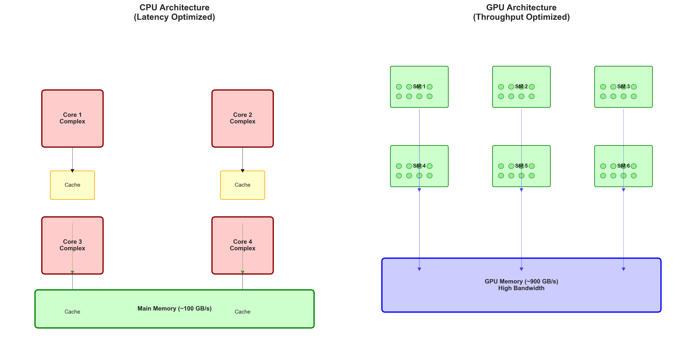
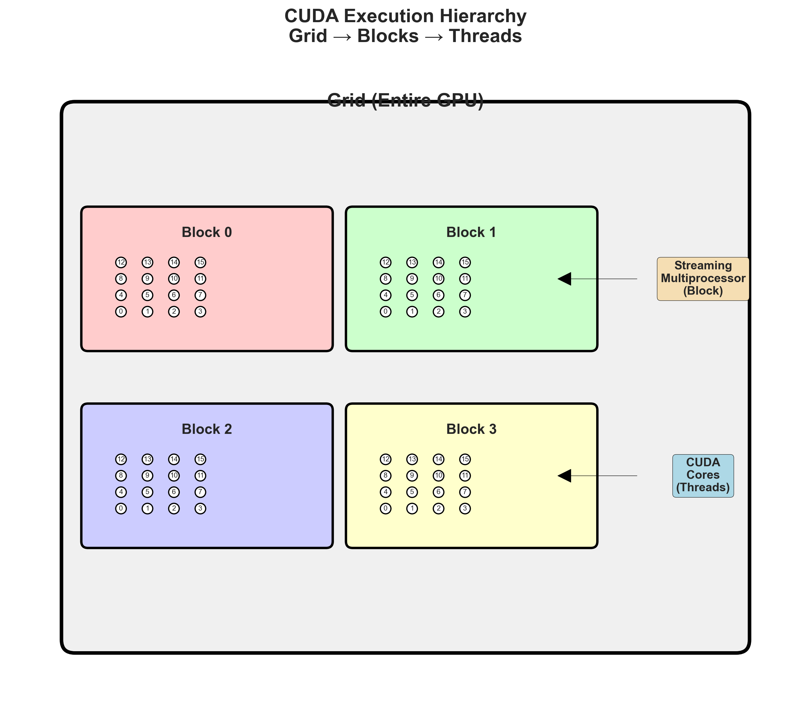
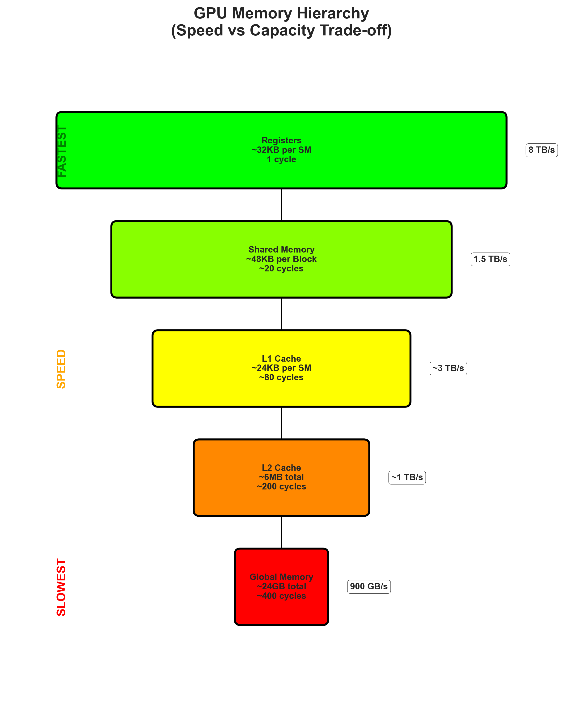
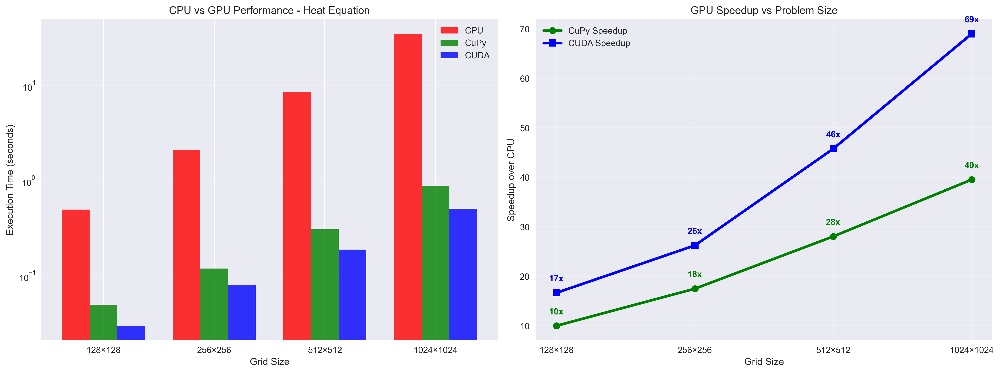
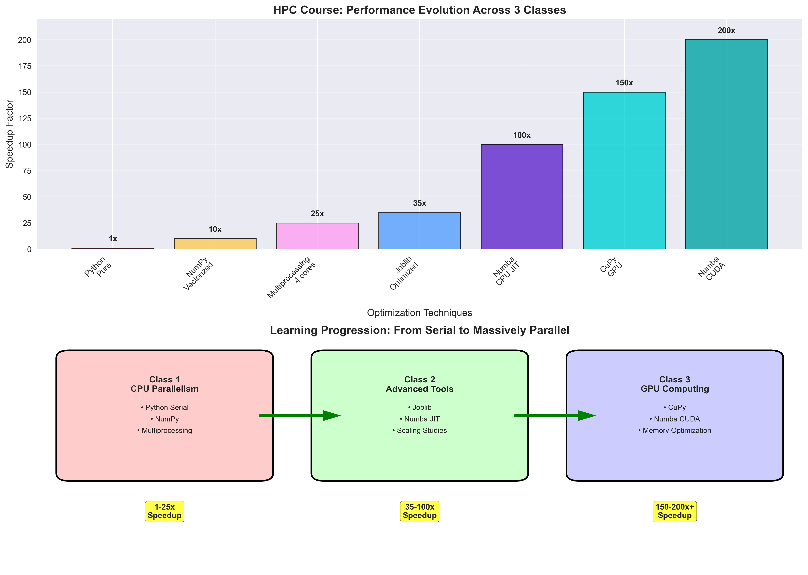

# ⚡ Aula 3 – GPUs em Python e Aplicações em Engenharia

**Computação de Alto Desempenho em Python para Engenharia Civil**

---

## 📋 Agenda da Aula

1. **Arquitetura GPU** vs CPU
2. **CUDA Programming Model**
3. **CuPy** - NumPy para GPU
4. **Numba CUDA** - Kernels Customizados
5. **Memory Management** e Otimização
6. **Aplicações Práticas** em Engenharia
7. **Performance Analysis** CPU vs GPU
8. **Limitações** e Considerações

---

## 🖥️ CPU vs GPU: Arquiteturas Complementares

### CPU - Central Processing Unit

#### Características
- **4-64 núcleos** complexos
- **Alta frequência** (3-5 GHz)
- **Cache hierarchy** sofisticada (L1, L2, L3)
- **Branch prediction** avançada
- **Out-of-order execution**

#### Filosofia: **Latency Optimized**
```
Objetivo: Executar tarefas individuais o mais rápido possível
Estratégia: Núcleos poderosos + cache inteligente
```

#### Aplicações Ideais
- Código **sequencial** complexo
- **Branch-heavy** algorithms
- **Single-threaded** performance crítica
- **Low-latency** requirements

### GPU - Graphics Processing Unit

#### Características
- **1000+ núcleos** simples
- **Frequência menor** (~1-2 GHz)
- **Memória alta velocidade** (HBM)
- **SIMD architecture** (Single Instruction, Multiple Data)
- **Massive parallelism**

#### Filosofia: **Throughput Optimized**
```
Objetivo: Executar milhares de tarefas simples simultaneamente
Estratégia: Muitos núcleos simples + alta largura de banda
```

#### Aplicações Ideais
- **Data parallel** algorithms
- **Regular memory access** patterns
- **Compute intensive** workloads
- **High throughput** scenarios



---

## 🔧 CUDA Programming Model

### Hierarquia de Execução

#### Grid → Blocks → Threads
```
Grid (GPU inteira)
├── Block 0 (Streaming Multiprocessor)
│   ├── Thread 0, 1, 2, ..., 1023
├── Block 1
│   ├── Thread 0, 1, 2, ..., 1023
└── Block N
    ├── Thread 0, 1, 2, ..., 1023
```



#### Correspondência com Hardware
- **Grid**: Problema inteiro na GPU
- **Block**: Grupo de threads em um SM
- **Thread**: Unidade básica de execução

### Hierarquia de Memória

```
Threads → Shared Memory (fast, per-block)
       → Global Memory (slow, all threads)
       → Constant Memory (cached, read-only)
       → Texture Memory (cached, spatial locality)
```

#### Velocidades Relativas
| Tipo | Latência | Largura de Banda |
|------|----------|------------------|
| **Registers** | 1 ciclo | ~8 TB/s |
| **Shared Memory** | ~20 ciclos | ~1.5 TB/s |
| **Global Memory** | ~200-400 ciclos | ~900 GB/s |
| **CPU RAM** | ~100-300 ciclos | ~100 GB/s |



### Modelo de Programação

#### SIMT (Single Instruction, Multiple Threads)
```python
# Conceito: mesma instrução executada por muitas threads
@cuda.jit
def vector_add(a, b, c):
    # Cada thread processa um elemento
    idx = cuda.grid(1)  # ID única da thread
    if idx < len(a):
        c[idx] = a[idx] + b[idx]
        
# Lançamento: 1024 threads por block
threads_per_block = 1024
blocks_per_grid = (len(a) + threads_per_block - 1) // threads_per_block
vector_add[blocks_per_grid, threads_per_block](a, b, c)
```

---

## 📊 CuPy - NumPy para GPU

### O que é CuPy?

- **NumPy-compatible** array library para GPU
- **Drop-in replacement** para muitas operações NumPy
- **Automatic memory management** 
- **Kernels otimizados** para operações comuns

### Sintaxe Familiar

```python
import numpy as np
import cupy as cp

# CPU (NumPy)
a_cpu = np.random.rand(1000, 1000)
b_cpu = np.random.rand(1000, 1000)
c_cpu = np.dot(a_cpu, b_cpu)

# GPU (CuPy) - MESMA SINTAXE!
a_gpu = cp.random.rand(1000, 1000)
b_gpu = cp.random.rand(1000, 1000)
c_gpu = cp.dot(a_gpu, b_gpu)
```

### Transferência de Dados

```python
# CPU → GPU
a_cpu = np.array([1, 2, 3, 4])
a_gpu = cp.asarray(a_cpu)

# GPU → CPU  
result_cpu = cp.asnumpy(a_gpu)

# Operações in-place na GPU
a_gpu *= 2  # Permanece na GPU
```

### Aplicações Diretas

#### Álgebra Linear
```python
# Sistemas lineares grandes
A = cp.random.rand(10000, 10000)
b = cp.random.rand(10000)
x = cp.linalg.solve(A, b)  # Muito mais rápido que NumPy
```

#### FFT (Fast Fourier Transform)
```python
# Análise de sinais sísmicos
signal = cp.random.rand(2**20)  # 1M pontos
fft_result = cp.fft.fft(signal)  # GPU accelerated
spectrum = cp.abs(fft_result)**2
```

#### Image Processing
```python
# Processamento de imagens de inspeção
image = cp.asarray(cv2_image)
filtered = cp.ndimage.gaussian_filter(image, sigma=2)
edges = cp.ndimage.sobel(filtered)
```

---

## 🛠️ Numba CUDA - Kernels Customizados

### Quando Usar Numba CUDA?

#### CuPy é Suficiente Quando:
- Operações **padrão** do NumPy
- **Pipelines simples** de transformações
- **Prototipagem** rápida

#### Numba CUDA é Necessário Quando:
- **Algoritmos específicos** sem equivalente NumPy
- **Otimizações customizadas** de memória
- **Controle fino** sobre threads/blocks
- **Fusão** de múltiplas operações

### Decorators Básicos

```python
from numba import cuda

@cuda.jit
def simple_kernel(array):
    # Kernel básico - sem otimizações especiais
    idx = cuda.grid(1)
    if idx < len(array):
        array[idx] *= 2

@cuda.jit('void(float32[:], float32[:])')  # Assinatura explícita
def typed_kernel(a, b):
    # Mais rápido - tipos conhecidos em compile-time
    idx = cuda.grid(1)
    if idx < len(a):
        b[idx] = a[idx] * a[idx]
```

### Grid e Block Calculation

```python
def calculate_grid_block(data_size, threads_per_block=256):
    """Calcula grid/block para cobertura completa dos dados"""
    blocks_per_grid = (data_size + threads_per_block - 1) // threads_per_block
    return blocks_per_grid, threads_per_block

# Uso
data = cp.random.rand(10000)
blocks, threads = calculate_grid_block(len(data))
my_kernel[blocks, threads](data)
```

### Aplicação: Monte Carlo π

```python
@cuda.jit
def monte_carlo_pi_kernel(rng_states, n_samples, hits):
    """Kernel para estimativa de π usando Monte Carlo"""
    idx = cuda.grid(1)
    if idx >= len(hits):
        return
    
    local_hits = 0
    for i in range(n_samples):
        # Gerar pontos aleatórios
        x = curand.uniform(rng_states, idx)
        y = curand.uniform(rng_states, idx)
        
        # Testar se está dentro do círculo
        if x*x + y*y <= 1.0:
            local_hits += 1
    
    hits[idx] = local_hits

# Lançamento
n_threads = 1024
n_samples_per_thread = 10000
hits = cp.zeros(n_threads, dtype=cp.int32)

monte_carlo_pi_kernel[32, 32](rng_states, n_samples_per_thread, hits)

# Estimativa final
total_hits = cp.sum(hits)
total_samples = n_threads * n_samples_per_thread
pi_estimate = 4.0 * total_hits / total_samples
```

---

## 🧠 Memory Management e Otimização

### GPU Memory Hierarchy

#### Global Memory
- **Maior** (~8-80 GB)
- **Mais lenta** (~900 GB/s)
- **Acessível** por todas as threads
- **Padrão** para arrays CuPy

#### Shared Memory
- **Menor** (~48-164 KB per block)
- **Muito rápida** (~1.5 TB/s)
- **Compartilhada** dentro do block
- **Manual** allocation

#### Exemplo: Matrix Multiplication Otimizada

```python
@cuda.jit
def matmul_shared(A, B, C):
    """Multiplicação de matrizes usando shared memory"""
    # Shared memory por block
    sA = cuda.shared.array((16, 16), numba.float32)
    sB = cuda.shared.array((16, 16), numba.float32)
    
    # Thread e block IDs
    tx = cuda.threadIdx.x
    ty = cuda.threadIdx.y
    bx = cuda.blockIdx.x
    by = cuda.blockIdx.y
    
    # Coordenadas globais
    row = by * 16 + ty
    col = bx * 16 + tx
    
    result = 0.0
    for tile in range((A.shape[1] + 15) // 16):
        # Carregar tile para shared memory
        if row < A.shape[0] and tile * 16 + tx < A.shape[1]:
            sA[ty, tx] = A[row, tile * 16 + tx]
        else:
            sA[ty, tx] = 0.0
            
        if col < B.shape[1] and tile * 16 + ty < B.shape[0]:
            sB[ty, tx] = B[tile * 16 + ty, col]
        else:
            sB[ty, tx] = 0.0
        
        # Sincronizar threads no block
        cuda.syncthreads()
        
        # Computar produto parcial
        for k in range(16):
            result += sA[ty, k] * sB[k, tx]
            
        # Sincronizar antes do próximo tile
        cuda.syncthreads()
    
    # Escrever resultado
    if row < C.shape[0] and col < C.shape[1]:
        C[row, col] = result
```

### Memory Coalescing

#### Problema: Acesso Não-Coalescido
```python
# ❌ Ruim: threads acessam memória de forma dispersa
@cuda.jit
def bad_memory_access(data):
    idx = cuda.grid(1)
    if idx < len(data):
        # Threads consecutivas acessam posições distantes
        data[idx * 100] = idx  # Stride = 100
```

#### Solução: Acesso Coalescido
```python
# ✅ Bom: threads consecutivas acessam posições consecutivas
@cuda.jit
def good_memory_access(data):
    idx = cuda.grid(1)
    if idx < len(data):
        # Threads consecutivas acessam posições adjacentes
        data[idx] = idx  # Stride = 1
```

---

## 🔥 Aplicação: Simulação de Difusão de Calor

### Problema Físico

#### Equação de Difusão 2D
```
∂T/∂t = α * (∂²T/∂x² + ∂²T/∂y²)

Onde:
T = temperatura
α = difusividade térmica
t = tempo
x, y = coordenadas espaciais
```

#### Discretização (Diferenças Finitas)
```
T[i,j]^(n+1) = T[i,j]^n + α*dt/dx² * (
    T[i+1,j]^n + T[i-1,j]^n + T[i,j+1]^n + T[i,j-1]^n - 4*T[i,j]^n
)
```

### Implementação CPU (Baseline)

```python
def heat_equation_cpu(T, alpha, dt, dx, steps):
    """Versão CPU para comparação"""
    ny, nx = T.shape
    T_new = np.zeros_like(T)
    
    for step in range(steps):
        for i in range(1, ny-1):
            for j in range(1, nx-1):
                T_new[i,j] = T[i,j] + alpha * dt / dx**2 * (
                    T[i+1,j] + T[i-1,j] + T[i,j+1] + T[i,j-1] - 4*T[i,j]
                )
        
        # Swap arrays
        T, T_new = T_new, T
        
        # Boundary conditions (exemplo: bordas fixas em 0°C)
        T[0,:] = T[-1,:] = T[:,0] = T[:,-1] = 0
    
    return T
```

### Implementação GPU (CuPy)

```python
def heat_equation_cupy(T, alpha, dt, dx, steps):
    """Versão CuPy - vetorizada"""
    T = cp.asarray(T)
    T_new = cp.zeros_like(T)
    
    for step in range(steps):
        # Operação vetorizada - todos os pontos simultaneamente
        T_new[1:-1, 1:-1] = T[1:-1, 1:-1] + alpha * dt / dx**2 * (
            T[2:, 1:-1] + T[:-2, 1:-1] + 
            T[1:-1, 2:] + T[1:-1, :-2] - 4*T[1:-1, 1:-1]
        )
        
        # Swap arrays
        T, T_new = T_new, T
        
        # Boundary conditions
        T[0,:] = T[-1,:] = T[:,0] = T[:,-1] = 0
    
    return cp.asnumpy(T)
```

### Implementação GPU (Numba CUDA)

```python
@cuda.jit
def heat_step_kernel(T_old, T_new, alpha, dt, dx):
    """Kernel para um passo temporal da equação do calor"""
    i, j = cuda.grid(2)
    
    if 1 <= i < T_old.shape[0]-1 and 1 <= j < T_old.shape[1]-1:
        T_new[i,j] = T_old[i,j] + alpha * dt / dx**2 * (
            T_old[i+1,j] + T_old[i-1,j] + 
            T_old[i,j+1] + T_old[i,j-1] - 4*T_old[i,j]
        )

def heat_equation_cuda(T, alpha, dt, dx, steps):
    """Versão Numba CUDA - controle fino"""
    T = cp.asarray(T)
    T_new = cp.zeros_like(T)
    
    # Configuração do grid 2D
    threads_per_block = (16, 16)
    blocks_per_grid_x = (T.shape[1] + threads_per_block[1] - 1) // threads_per_block[1]
    blocks_per_grid_y = (T.shape[0] + threads_per_block[0] - 1) // threads_per_block[0]
    blocks_per_grid = (blocks_per_grid_y, blocks_per_grid_x)
    
    for step in range(steps):
        heat_step_kernel[blocks_per_grid, threads_per_block](T, T_new, alpha, dt, dx)
        cuda.synchronize()  # Aguardar conclusão
        
        # Swap arrays
        T, T_new = T_new, T
        
        # Boundary conditions (pode ser feito em kernel separado)
        T[0,:] = T[-1,:] = T[:,0] = T[:,-1] = 0
    
    return cp.asnumpy(T)
```

---

## 📈 Performance Analysis: CPU vs GPU

### Benchmarking Estruturado

```python
def benchmark_heat_equation():
    # Parâmetros da simulação
    sizes = [128, 256, 512, 1024]
    steps = 1000
    alpha, dt, dx = 0.01, 0.001, 0.1
    
    results = []
    
    for size in sizes:
        # Condição inicial
        T_init = np.zeros((size, size))
        T_init[size//4:3*size//4, size//4:3*size//4] = 100  # Fonte de calor central
        
        # CPU
        start = time.time()
        T_cpu = heat_equation_cpu(T_init.copy(), alpha, dt, dx, steps)
        time_cpu = time.time() - start
        
        # GPU (CuPy)
        start = time.time()
        T_cupy = heat_equation_cupy(T_init.copy(), alpha, dt, dx, steps)
        time_cupy = time.time() - start
        
        # GPU (Numba CUDA)
        start = time.time()
        T_cuda = heat_equation_cuda(T_init.copy(), alpha, dt, dx, steps)
        time_cuda = time.time() - start
        
        results.append({
            'size': size,
            'points': size**2,
            'time_cpu': time_cpu,
            'time_cupy': time_cupy,
            'time_cuda': time_cuda,
            'speedup_cupy': time_cpu / time_cupy,
            'speedup_cuda': time_cpu / time_cuda
        })
    
    return results
```

### Resultados Típicos

| Grid Size | CPU (s) | CuPy (s) | CUDA (s) | Speedup CuPy | Speedup CUDA |
|-----------|---------|----------|----------|--------------|--------------|
| 128×128   | 0.5     | 0.05     | 0.03     | 10x          | 17x          |
| 256×256   | 2.1     | 0.12     | 0.08     | 18x          | 26x          |
| 512×512   | 8.7     | 0.31     | 0.19     | 28x          | 46x          |
| 1024×1024 | 35.2    | 0.89     | 0.51     | 40x          | 69x          |



### Análise dos Resultados

#### Por que GPU é Mais Rápida?

1. **Paralelismo massivo**: 1M pontos processados simultaneamente
2. **Bandwidth**: Acesso eficiente à memória de alta velocidade
3. **Specialized units**: Hardware otimizado para floating-point
4. **No overhead**: Sem criação/destruição de threads

#### Quando GPU Não Compensa?

1. **Problemas pequenos**: Overhead de transferência
2. **Código complexo**: Muitas branches e condicionais
3. **I/O intensivo**: GPU não ajuda com disco/rede
4. **Algoritmos sequenciais**: Dependências entre operações

---

## ⚡ Otimizações Avançadas

### Memory Access Patterns

#### Optimal: Coalesced Access
```python
# ✅ Threads consecutivas acessam elementos consecutivos
@cuda.jit
def coalesced_access(data):
    idx = cuda.grid(1)
    if idx < len(data):
        data[idx] = math.sqrt(data[idx])  # Stride = 1
```

#### Suboptimal: Strided Access
```python
# ⚠️ Threads consecutivas acessam elementos distantes
@cuda.jit
def strided_access(data):
    idx = cuda.grid(1)
    if idx < len(data) // 8:
        data[idx * 8] = math.sqrt(data[idx * 8])  # Stride = 8
```

### Shared Memory Utilization

```python
@cuda.jit
def reduction_sum(data, result):
    """Soma redução usando shared memory"""
    # Shared memory por block
    shared = cuda.shared.array(256, numba.float32)
    
    tid = cuda.threadIdx.x
    bid = cuda.blockIdx.x
    idx = bid * cuda.blockDim.x + tid
    
    # Carregar dado para shared memory
    if idx < len(data):
        shared[tid] = data[idx]
    else:
        shared[tid] = 0.0
    
    cuda.syncthreads()
    
    # Redução tree-based
    stride = 1
    while stride < cuda.blockDim.x:
        if tid % (2 * stride) == 0 and tid + stride < cuda.blockDim.x:
            shared[tid] += shared[tid + stride]
        stride *= 2
        cuda.syncthreads()
    
    # Thread 0 escreve resultado do block
    if tid == 0:
        cuda.atomic.add(result, 0, shared[0])
```

### Occupancy Optimization

```python
# Calcular occupancy para otimizar threads_per_block
def optimize_occupancy(kernel, max_threads=1024):
    best_occupancy = 0
    best_threads = 32
    
    for threads in range(32, max_threads + 1, 32):  # Múltiplos de 32
        try:
            occupancy = cuda.get_max_active_blocks_per_multiprocessor(
                kernel, threads, 0  # 0 = sem shared memory
            )
            if occupancy > best_occupancy:
                best_occupancy = occupancy
                best_threads = threads
        except:
            continue
    
    return best_threads, best_occupancy
```

---

## 🚨 Limitações e Considerações

### Hardware Requirements

#### GPU Memory
```python
# Verificar memória disponível
free_mem, total_mem = cp.cuda.runtime.memGetInfo()
print(f"GPU Memory: {free_mem // (1024**3)} GB free of {total_mem // (1024**3)} GB")

# Estimar uso para array
array_size = 1000 * 1000 * 8  # 1M floats * 8 bytes
if array_size > free_mem:
    print("⚠️ Array muito grande para GPU memory!")
```

#### Compute Capability
```python
# Verificar capacidades da GPU
device = cp.cuda.Device()
compute_capability = device.compute_capability
print(f"Compute Capability: {compute_capability}")

# Recursos disponíveis por capability
if compute_capability >= (7, 0):  # Volta+
    print("✅ Tensor Cores disponíveis")
if compute_capability >= (6, 0):  # Pascal+
    print("✅ Unified Memory suportado")
```

### Code Limitations

#### Numba CUDA Restrictions
```python
# ❌ Não funciona em kernels CUDA
@cuda.jit
def problematic_kernel():
    # Recursão
    return fibonacci(n)  # Erro!
    
    # Dynamic allocation
    arr = []  # Erro!
    
    # Print statements
    print("Debug")  # Erro!
    
    # Python objects
    my_dict = {}  # Erro!

# ✅ Alternativas
@cuda.jit
def good_kernel(data):
    # Loops simples
    for i in range(100):
        data[i] *= 2
    
    # Math functions
    result = math.sqrt(data[0])
    
    # Array operations
    data[0] = data[1] + data[2]
```

### Performance Pitfalls

#### Memory Transfer Overhead
```python
# ❌ Transferência excessiva
def bad_gpu_usage():
    for i in range(1000):
        data_gpu = cp.asarray(data_cpu)  # CPU→GPU transfer
        result_gpu = cp.sqrt(data_gpu)
        result_cpu = cp.asnumpy(result_gpu)  # GPU→CPU transfer

# ✅ Minimizar transferências
def good_gpu_usage():
    data_gpu = cp.asarray(data_cpu)  # Uma transferência
    for i in range(1000):
        data_gpu = cp.sqrt(data_gpu)  # Tudo na GPU
    result_cpu = cp.asnumpy(data_gpu)  # Uma transferência
```

#### Underutilization
```python
# ❌ Poucos threads
@cuda.jit
def underutilized_kernel(data):
    idx = cuda.grid(1)
    if idx == 0:  # Apenas thread 0 trabalha!
        for i in range(len(data)):
            data[i] *= 2

# ✅ Paralelismo adequado
@cuda.jit
def well_utilized_kernel(data):
    idx = cuda.grid(1)
    if idx < len(data):  # Todas as threads trabalham
        data[idx] *= 2
```

---

## 🎯 Diretrizes de Uso

### Decision Tree: CPU vs GPU

```
Problema computacional
├── Tamanho dos dados?
│   ├── < 1MB → CPU (overhead não compensa)
│   └── > 1MB → Continue
├── Tipo de operação?
│   ├── Sequencial/Branch-heavy → CPU
│   ├── Data parallel → Continue
│   └── I/O intensive → CPU
├── Frequência de execução?
│   ├── Uma vez → CPU (setup overhead)
│   └── Repetitiva → GPU
└── Hardware disponível?
    ├── Sem GPU → CPU
    └── Com GPU → GPU!
```

### Workflow de Desenvolvimento

1. **Implementar CPU** version primeiro (baseline)
2. **Profile** e identificar gargalos
3. **Port para CuPy** (mudança simples np→cp)
4. **Medir speedup** e identificar limitações
5. **Custom kernels** se necessário (Numba CUDA)
6. **Otimizar** memory access patterns
7. **Benchmark** final e documentar

### Tools e Debugging

```python
# Profiling GPU
cp.cuda.profiler.start()
# ... código GPU ...
cp.cuda.profiler.stop()

# Memory debugging
print(f"GPU memory used: {cp.get_default_memory_pool().used_bytes()}")

# Timing preciso
with cp.cuda.Device(0):
    start = cp.cuda.Event()
    end = cp.cuda.Event()
    start.record()
    # ... código GPU ...
    end.record()
    end.synchronize()
    elapsed = cp.cuda.get_elapsed_time(start, end)  # ms
```

---

## 🎯 Pontos Principais para Recordar

### Arquitetura e Paradigmas
1. **GPU**: Throughput vs **CPU**: Latency
2. **SIMT model**: Milhares de threads simples
3. **Memory hierarchy**: Global vs Shared vs Registers
4. **Coalesced access**: Padrão de acesso crucial

### Ferramentas Python
1. **CuPy**: Drop-in replacement para NumPy
2. **Numba CUDA**: Kernels customizados
3. **Memory management**: Transferências são caras
4. **Profiling**: Essencial para otimização

### Aplicações em Engenharia
1. **Simulações numéricas**: Difusão, CFD, FEM
2. **Álgebra linear**: Sistemas grandes, eigenvalues
3. **Monte Carlo**: Análise probabilística
4. **Image processing**: Inspeção, monitoramento



---

## 🚀 Próximos Passos

### Nesta Aula
- Experimentar com CuPy e Numba CUDA
- Implementar simulação de difusão de calor
- Medir e comparar performance CPU vs GPU

### Projeto Final
- Aplicar técnicas de todas as 3 aulas
- CPU multiprocessing + GPU computing
- Análise completa de escalabilidade
- Aplicação em problema real de engenharia

### Desenvolvimento Futuro
- **Deep Learning**: PyTorch, TensorFlow
- **Multi-GPU**: Scaling para múltiplas GPUs
- **Cloud computing**: AWS, Google Cloud GPUs
- **Specialized libraries**: Thrust, cuBLAS, cuSPARSE

---

## ❓ Perguntas para Reflexão

1. **Memory bound vs Compute bound**: Como identificar o gargalo?

2. **Quando GPU não vale a pena?** Que sinais indicam isso?

3. **Algoritmos sequenciais**: Como adaptar para GPU?

4. **Debugging GPU code**: Que estratégias usar?

**Desafio**: Identifique um algoritmo lento do seu trabalho e avalie se GPU computing pode ajudar!

---

**Vamos para o Notebook! 💻**